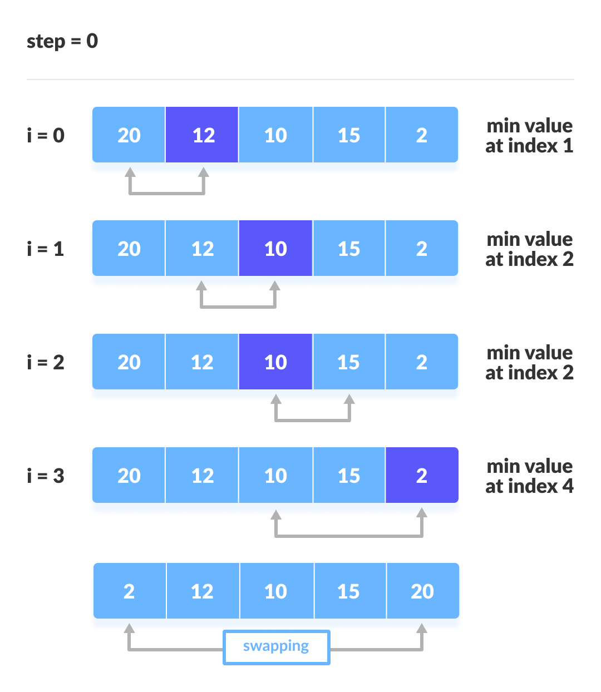

- Selection Sort Explained Simply
The selection sort algorithm is like organizing a line of people by height. Imagine you have a group of people standing in a line, and you want to arrange them from shortest to tallest.

